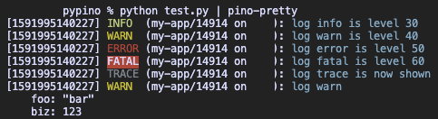

# pypino
_A Python JSON logger with output matching Pino.js_

While working in Node.js, I always use [Pino.js](https://getpino.io/). The output is quickly parsable by my logging system, but the output is still quite readable for humans. There are several of logging solutions for Python, but rather than write an independent log parser, I wrote a logging module which is compatible with Pino.js.

There are other modules, but nothing that met my list of requirements:

- Use the same handlers used by Pino, ex: `log.warn(...)`.
- Be able to pass basic dicts of extra keys to be included in JSON, ex: `log.error({"foo": "bar"}, "foo is bar")`.
- The output format must CLOSELY match Pino.js. All keys, structure and data formatting should match.
- Lightweight, low overhead, dependency light.
- Compatible with older versions of Python.

Example usage:

```python
import pypino

log = pypino.PyPino(name="my-app")

# All common log types. Default log level is ">= info", so trace and debug are not shown
log.trace("log trace is level 10")
log.debug("log debug is level 20")
log.info("log info is level 30")
log.warn("log warn is level 40")
log.error("log error is level 50")
log.fatal("log fatal is level 60")
# out: {"hostname":"myhost","pid":14668,"name":"my-app","level":60,"time":1591994603380,"msg":"log1 fatal"}

# Alter the logging level
log.level("trace")
log.trace("log trace is now shown")

# Add additional kv context
log.warn({"foo": "bar", "biz": 123}, "log warn")
# out: {"hostname":"myhost","pid":14786,"name":"my-app","level":40,"time":1591994920229,"foo":"bar","biz":123,"msg":"log1 warn"}
```

And just like with Pino, you can pipe the output through [pino-pretty](https://github.com/pinojs/pino-pretty).

